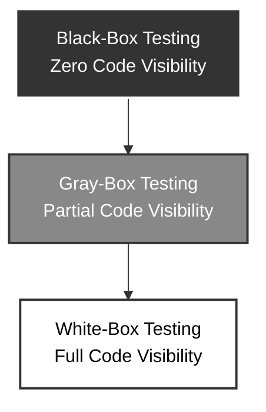

# Software Architecture: Code Accessibility in Testing

Code accessibility defines how much visibility a quality assurance engineer has into the application's underlying codebase while executing tests.

## 📊 Workflow Diagram

## 🔑 Access Methodologies Breakdown

### 1. Black-Box Testing
Validates application functionality purely from an end-user or specification perspective without internal code access.
* **Core Goal**: Verifies that the platform conforms directly to explicit requirements and visual layouts.
* **Scope**: Evaluates external entry points, including back-end interfaces like API endpoints and SQL databases.
* **Visibility**: The tester does not view the code and operates without knowing how it works "under the hood."

### 2. Gray-Box Testing
Combines high-level black-box execution with occasional deep dives into the underlying technical architecture.
* **Core Goal**: Uses structural and architectural awareness to design more effective functional test scenarios.
* **Scope**: Relies primarily on the external representation of the service logic while inspecting code as needed.
* **Visibility**: The tester knows the system architecture intimately and selectively references code to pinpoint issues.

### 3. White-Box (Clear-Box) Testing
Examines the internal structures, code design, logic paths, and data flows of the software application.
* **Core Goal**: Verifies statement coverage, branch path execution, and structural integrity of the code.
* **Scope**: Conducts code reviews, unit testing, and localized bug hunting directly inside the repository.
* **Visibility**: The tester works with full code transparency and understands exactly how features work "under the hood."
