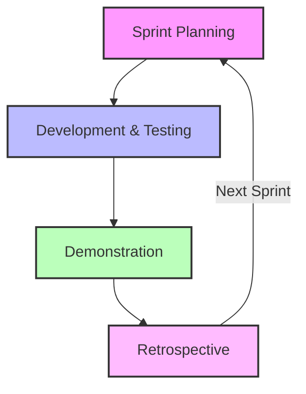

# Iterative Development: Agile Scrum Methodology

The Agile Scrum methodology breaks project activities into cyclical intervals called sprints. Each sprint delivers a functional product increment based on continuous feedback. 

## 📊 Workflow Diagram

## 🔄 Sprint Phases & QA Responsibilities

### 1. Sprint Planning
The team agrees on their goals for the upcoming sprint.
* **QA Focus**: Assesses the total workload and technical difficulty from a quality perspective.

### 2. Development and Testing
The core team builds, runs quality checks, and releases the software into production.
* **QA Focus**: Compiles test documentation and validates all new functionality for the initial release.

### 3. Demonstration
The team presents completed work to stakeholders to secure instant feedback and adapt to new requirements.
* **QA Focus**: Analyzes stakeholder interactions to understand how end-users will interact with the product.

### 4. Retrospective
The team reflects on the sprint to celebrate wins, analyze mistakes, and identify process bottlenecks.
* **QA Focus**: Evaluates the sprint lifecycle to propose concrete ideas for improving product development.

After the retrospective concludes, a new sprint loop begins immediately.
