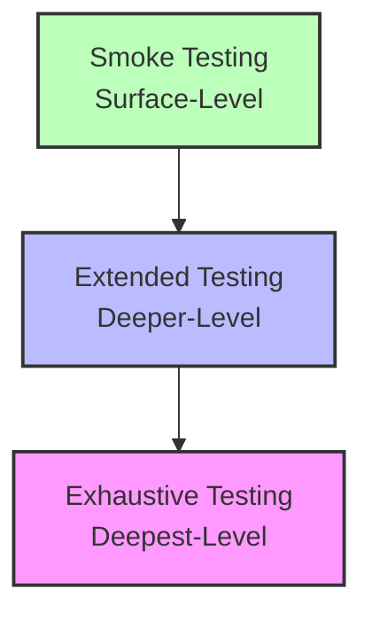

# Software Architecture: Depth of Testing

The depth of testing determines how thoroughly software features are validated based on project priorities, documentation, and the severity of bugs.

## 📊 Workflow Diagram

## 🔍 Testing Levels Breakdown

### 1. Smoke Testing (Surface-Level)
Verifies that the primary and most critical features of the service operate correctly.
* **Core Goal**: Confirms key user journeys work, such as verifying users can complete a product purchase.
* **Scope**: The number of checks varies by project; the team defines which features are critical.

### 2. Extended Testing (Deeper-Level)
Performs a thorough validation of the software by diving deep into specific system behaviors.
* **Core Goal**: Ensures complete alignment between the software behavior and the formal specifications.
* **Scope**: Executes tests against all technical and functional requirements found in the project documentation.

### 3. Exhaustive Testing (Deepest-Level)
Examines every possible input, scenario, and edge case across all features of the service.
* **Core Goal**: Minimizes technical risks for critical systems where the cost of a single bug is catastrophic.
* **Scope**: Evaluates every single feature; mandatory for software linked directly to health, safety, and security.
