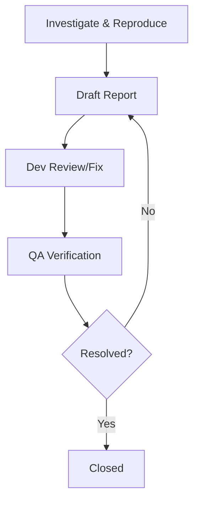

# Engineering Standards: How to Write a Bug Report

A high-quality bug report acts as the critical bridge between **Quality Assurance (QA)** and **Development**. Its primary purpose is to ensure that bugs are resolved by clearly identifying, diagnosing, and documenting issues.

## 📊 Bug Life Cycle

## 🏗️ Essential Report Structure

Every report should follow a consistent formula to help developers identify the root cause quickly.

### 1. Summary/Title
Capture the essence of the problem concisely. It should answer **What**, **When**, and **Where** without being overbearing.
*   *Bad:* "The button doesn't work."
*   *Good:* "Checkout Page — 'Pay Now' button unresponsive on iOS Safari 17.0".

### 2. Description & Preconditions
*   **Preconditions**: Any state the system must be in before testing (e.g., "User must be logged in with a Pro account").
*   **Steps to Reproduce**: A numbered sequence of exact actions needed to trigger the bug. Avoid skipping steps or making assumptions.

### 3. Results & Environment
*   **Expected Result**: What should have happened according to requirements.
*   **Actual Results**: What actually occurred during the test.
*   **Environment**: Crucial technical details such as OS, browser names, and specific versions.

### 4. Categorization
*   **Severity**: The technical impact of the bug on the system (e.g., "Critical" if it crashes the app).
*   **Priority**: The business urgency for fixing the issue.

### 5. Evidence & Attachments
Providing visual proof speeds up the debugging process significantly.
*   **Visuals**: Screenshots with highlights or screen recordings (casts).
*   **Technical Data**: System logs, console errors, or stack traces.
*   **Version Info**: The specific development branch or application version affected.

## 🎯 Core Focus Areas

*   **Clarity**: Be descriptive and avoid vague wording.
*   **Reproducibility**: If a bug cannot be reproduced reliably, it likely cannot be fixed.
*   **Objectivity**: Stick to facts and data; avoid opinions or frustrations. Remember you are writing for an audience of developers, testers, and managers.

## 🚦 To Report or Not to Report?

Before submitting, follow these validation steps:
1.  **Investigate**: Try to identify the root cause and collect all relevant data.
2.  **Verify**: Try to reproduce the bug in different environments, such as production.
3.  **Audit**: Search the bug tracking system to ensure it hasn't been reported previously.
4.  **Confirm**: When in doubt, ask a Project Manager or peer QA Engineer to confirm if the behavior is indeed a bug.
