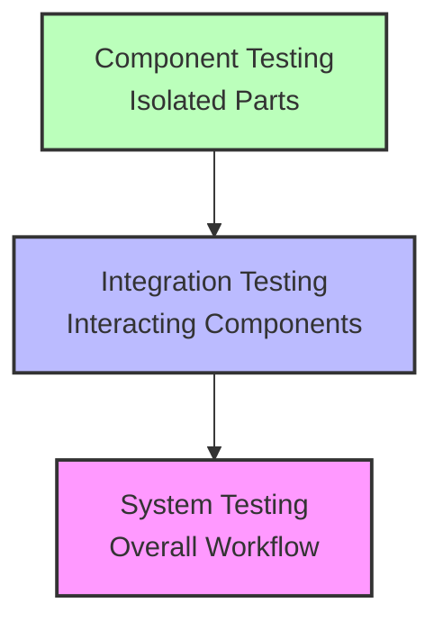

# Software Architecture: Levels of Isolation in Testing

The levels of isolation determine how tightly or loosely individual parts of a system are bound together during quality assurance validation.

## 📊 Workflow Diagram

## 🔬 Isolation Levels Breakdown

### 1. Component Testing
Validates individual pieces of code or software modules completely on their own.
* **Core Goal**: Isolates a single unit to ensure its internal logic operates correctly.
* **Scope**: Checks parts individually without considering or connecting to other system parts.

### 2. Integration Testing
Evaluates the communication paths and data transfer between previously isolated modules.
* **Core Goal**: Exposes defects in the interfaces and connectivity between distinct blocks.
* **Scope**: Focuses exclusively on how independent components interact with one another.

### 3. System Testing
Verifies the complete, end-to-end software application as an integrated whole.
* **Core Goal**: Validates total platform performance, security, and functional compliance.
* **Scope**: Tests how the overall system works by combining and executing several components at once.
