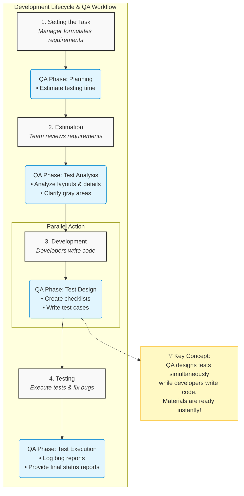

# 📋 QA Responsibilities by Development Stage

Every development task is divided into structured stages. QA engineers hold critical responsibilities throughout each phase of this lifecycle.

---

## 🗺️ Visual Workflow

GitHub natively renders the flowchart below to show how QA work mirrors the development track.

---

## ⚡ Interactive Tracking Table

Use the checkboxes directly inside your GitHub repository or issue description to track your QA team's progress for each task.

| Stage | QA Phase | Core Responsibilities | Deliverables / Status |
| :--- | :--- | :--- | :--- |
| **1. Setting the Task** | `Planning` | <ul><li>[ ] Evaluate total testing time</li><li>[ ] Assess initial requirements</li></ul> | `⏱️ Awaiting Estimate` |
| **2. Estimation** | `Test Analysis` | <ul><li>[ ] Analyze requirements and layouts</li><li>[ ] Clarify gray areas with stakeholders</li></ul> | `🔍 In Progress` |
| **3. Development** | `Test Design` | <ul><li>[ ] Create testing checklists</li><li>[ ] Write detailed test cases</li></ul> | `✍️ Paralleled with Dev` |
| **4. Testing** | `Test Execution` | <ul><li>[ ] Test new app features</li><li>[ ] Document and log bug reports</li><li>[ ] Deliver final feature status reports</li></ul> | `🚀 Ready to Execute` |

> 💡 **Parallel Workflow Tip:** While developers are busy writing code, QA engineers are actively designing tests. By the time development finishes, testing materials are already live and ready to deploy.
