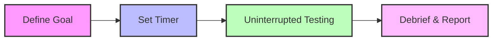

# Exploratory Testing: Session-Based Testing (SBT)

Session-based testing is a structured approach to exploratory testing where work is divided into uninterrupted, focused blocks of time. Each session targets a specific area of the application to ensure deep coverage without distractions.

## 📊 Session-Based Workflow

## ⏱️ The Session Structure
A session is typically a **60 to 90-minute block** dedicated to one mission. During this time, the engineer focuses exclusively on the assigned charter.

### Core Testing Charters
You can dedicate individual sessions to the following pillars of quality:

*   **🛡️ Security**: Probing for vulnerabilities, unauthorized access points, and data leaks.
*   **⚙️ Features**: Validating that specific functional requirements work as intended.
*   **💎 Usability**: Evaluating how intuitive and user-friendly the interface feels.
*   **📈 Performance**: Testing how the system handles stress, speed, and high data loads.
*   **🛠️ Reliability**: Ensuring the product remains stable over time and under varying conditions.

## 📝 Session Reporting
Unlike scripted testing, SBT results are documented in a **Session Note**, which includes:
1.  **Charter**: What was tested.
2.  **Findings**: A list of bugs or interesting behaviors discovered.
3.  **Obstacles**: Anything that blocked testing (e.g., environment crashes).
4.  **Data**: Time spent on testing vs. time spent on setup.
