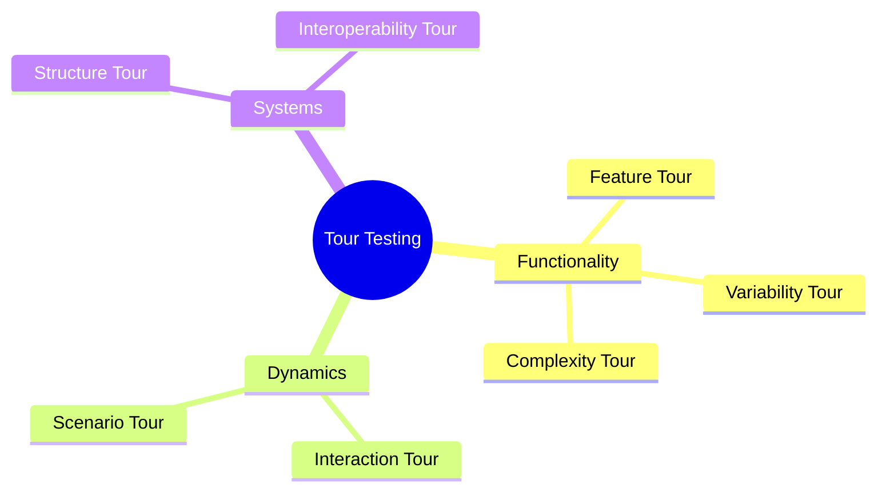

# Exploratory Testing: The Tour Method

The Tour Method organizes exploratory testing by defining specific "tours" through the application to ensure thorough coverage from multiple perspectives.

## 📊 Testing Tours Workflow

## 🎒 Tour Breakdown

### 🎯 Feature Tour
We explore as many available controls and features as possible.
*   **Key Question**: "What is the purpose of this feature?"

### ⚙️ Variability Tour
Tests different combinations of settings for all customizable elements.
*   **Core Goal**: Find the absolute limits of the software.

### 🧩 Complexity Tour
Targets the most intricate features and data structures.
*   **Core Goal**: Hunt for inextricable bugs lurking in complex logic.

### 🤝 Interaction Tour
Focuses on the relationships between different modules.
*   **Core Goal**: Validate how different parts of the software interact with each other.

### 🎭 Scenario Tour
Mimics realistic user behaviors by creating and playing out "user stories."
*   **Core Goal**: Ensure user-system interactions reflect real-world usage.

### 🏗️ Structure Tour
Analyzes the underlying framework of the application.
*   **Core Goal**: Explicitly define and validate the physical or logical structure of the software.

### 🌐 Interoperability/Data Tour
Checks external connectivity and data consistency.
*   **Core Goal**: Verify the system interacts correctly with third-party apps and that shared data updates as expected.
