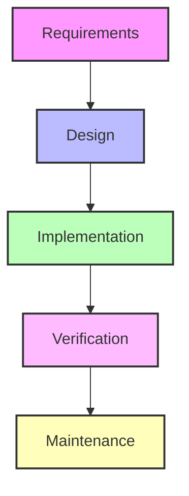

# Sequential Development: The Waterfall Model

The Waterfall Model breaks down project activities into linear sequential phases. Each phase depends entirely on the deliverables of the previous one. This model requires a set budget, deadlines, and strict processes.

## 📊 Workflow Diagram

## 🎯 When the Waterfall Model is Useful

* **Fixed Requirements**: Product requirements are set and unlikely to change.
* **Predictable Outcomes**: The desired result is known in advance, simplifying deadline and budget planning.
* **Step-by-Step Delivery**: Product development naturally breaks down into sequential stages.

## ⚠️ Potential Drawbacks

* **Low Flexibility**: Making minor alterations requires rewriting documentation and updating processes.
* **High Financial Risk**: Late-stage changes can increase the project cost dramatically.
